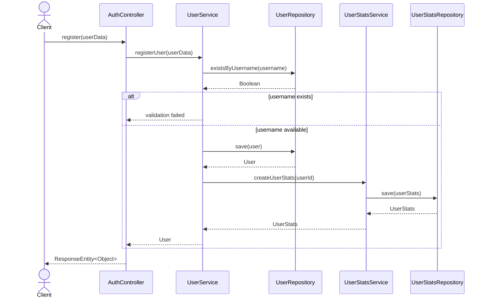
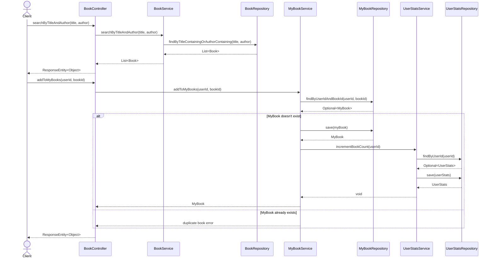
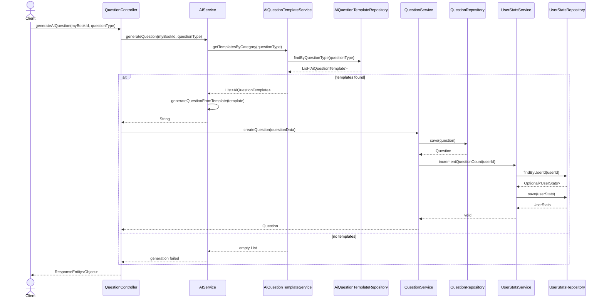
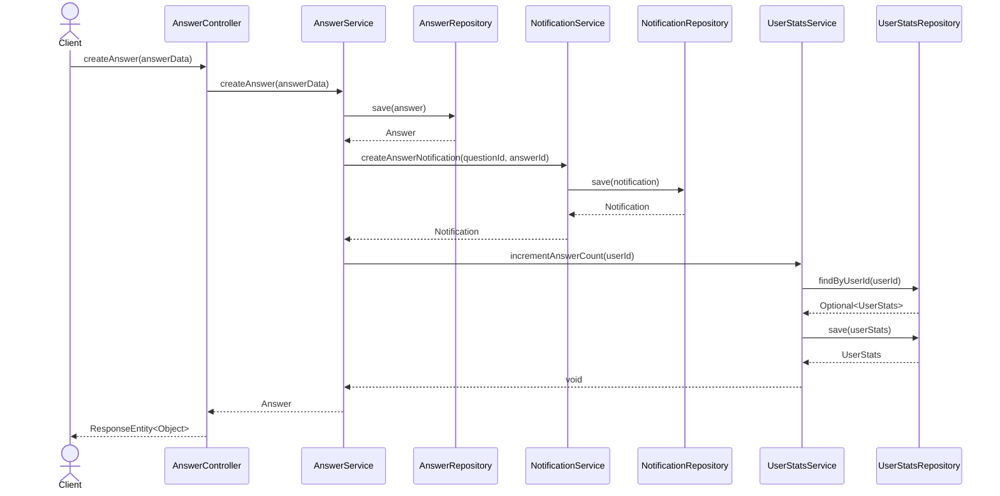
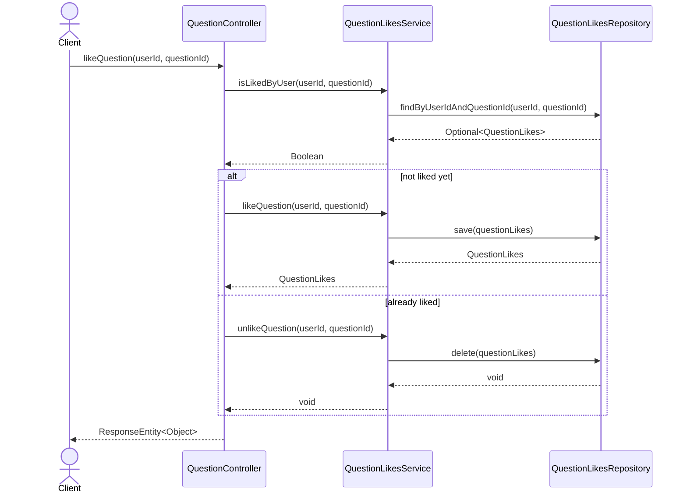
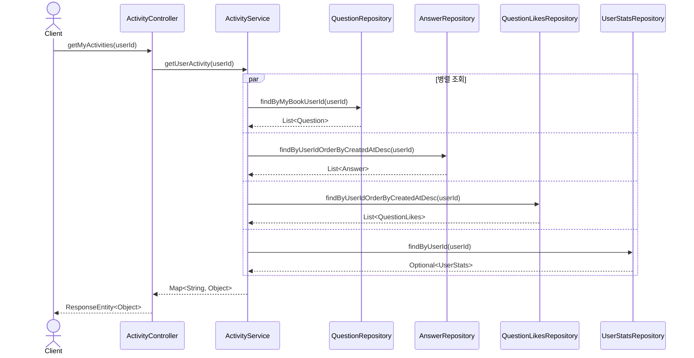
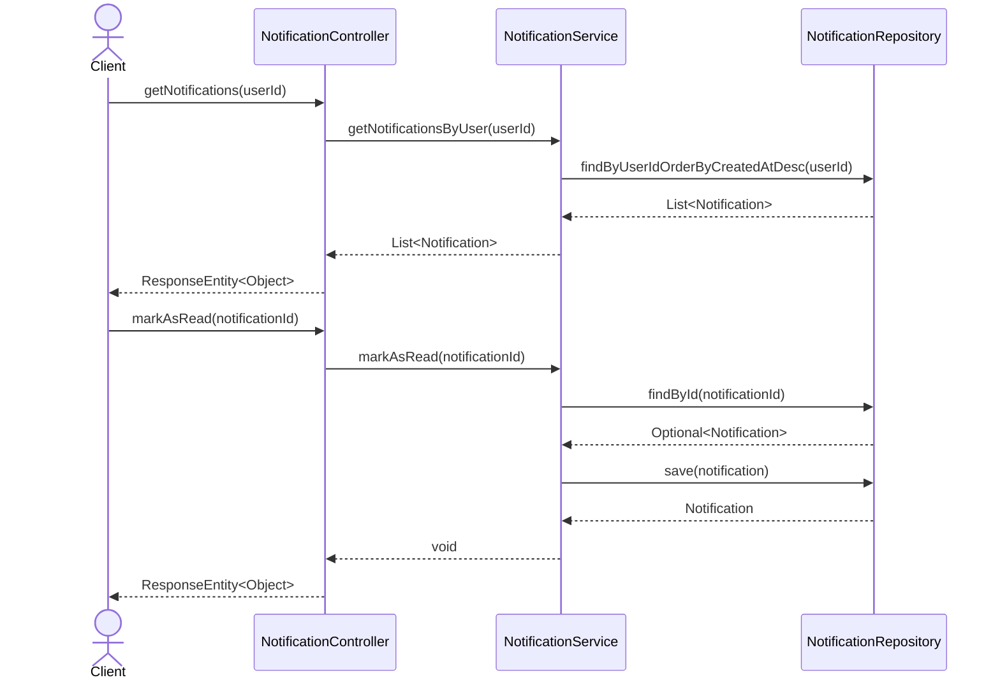
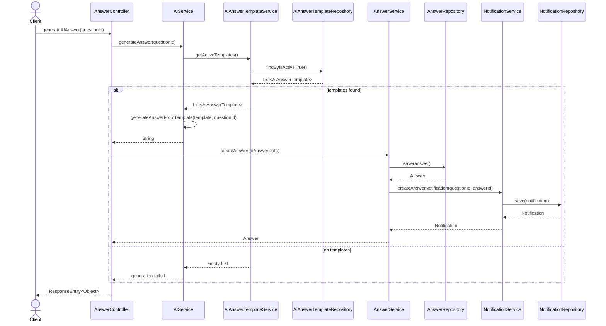
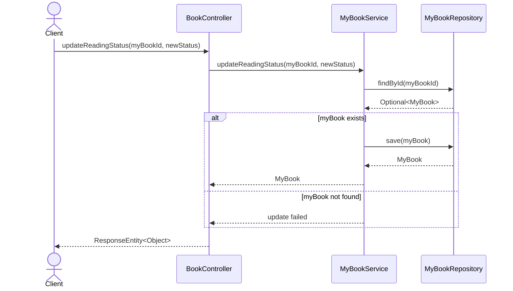
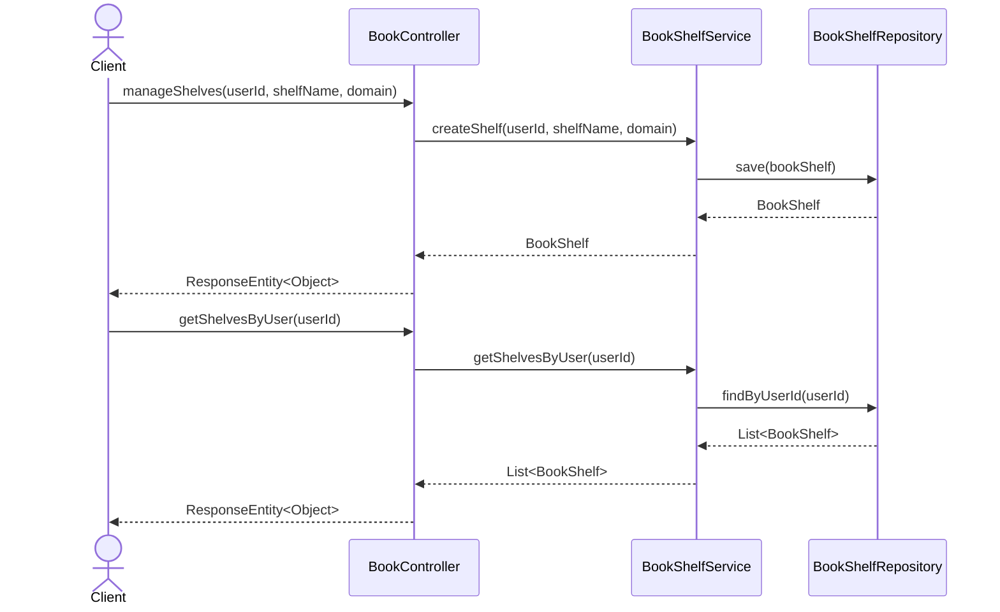

## 1. 사용자 회원가입 및 로그인

## 2. 도서 검색 및 내 서재 추가

## 3. 질문 생성 (AI 템플릿 사용)

## 4. 답변 작성 및 알림 생성

## 5. 질문 좋아요/취소

## 6. 내 활동 조회

## 7. 알림 조회 및 읽음 처리

## 8. AI 답변 생성

## 9. 도서 상태 변경

## 10. 서재 관리

